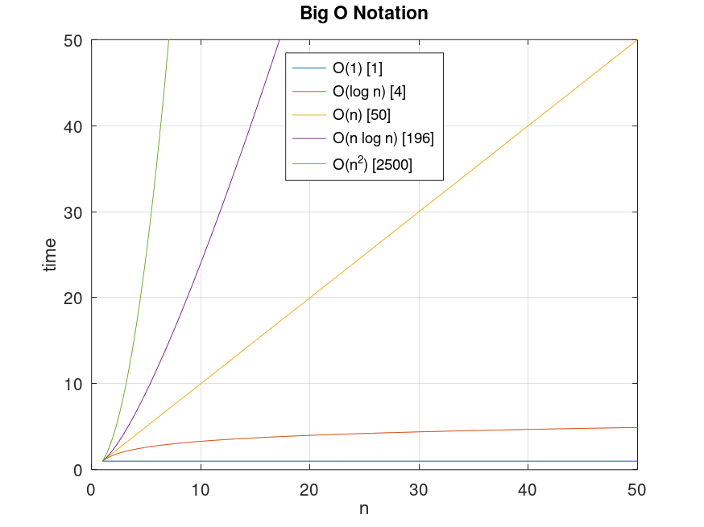

- ["Big O" Notation](#big-o-notation)
  - [Links](#links)
  - [Alternatives](#alternatives)
    - [Big Ω (Omega Notation)](#big-ω-omega-notation)
    - [Big-Θ (Big-Theta Notation)](#big-θ-big-theta-notation)
  - [Orders of Common Functions](#orders-of-common-functions)
  - [Orders of Uncommon Functions](#orders-of-uncommon-functions)
  - [Examples](#examples)
    - [O(1)](#o1)
    - [O(log n)](#olog-n)
    - [O(n)](#on)
    - [O(n log n)](#on-log-n)
    - [O(n$^2$)](#on2)
  - [Graph](#graph)

# "Big O" Notation

**Big O** is a measure of **memory** and/or **time** complexity in an algorithm and is recorded in terms of "worst-case".

There can be differences between the same Time Complexity. (eg: `O(n)` = `O(2n)` in big-O) and it is important to be as efficient as possible, even within each time complexity grouping.

> ⓘ Info: The "O" in "Big O" stands for Order. (From the german word "Ordnung")

## Links

| Title                                                                                                                                                             | Site              | Description                                |
| ----------------------------------------------------------------------------------------------------------------------------------------------------------------- | ----------------- | ------------------------------------------ |
| [Big O Notation in Javascript](https://www.doabledanny.com/big-o-notation-in-javascript)                                                                          | Doable Danny      | The Ultimate Beginners Guide with Examples |
| [The Big-O Cheat Sheet](https://www.bigocheatsheet.com/)                                                                                                          | Big-O Cheat Sheet | A very cool reference with graphs and data |
| [Step-by-Step Big O Complexity Analysis Guide, using Javscript](https://www.sahinarslan.tech/posts/step-by-step-big-o-complexity-analysis-guide-using-javascript) | Şahin Arslan      | A beginner friendly presentation of Big-O  |

## Alternatives

Big-O makes the most sense to ensure confidence that algorithms scale properly and will work as intended without leaving users frustrated with load times and program lock-ups. However, it can be interesting to consider best-case or average-case complexity.

### Big Ω (Omega Notation)

Considers the "best case" result of an algorithm. This is considered far less useful than Big-O because it usually does not suitably indicate how an algorithm will scale.

### Big-Θ (Big-Theta Notation)

Simply put, the area between Big-Omega and Big-O.

## Orders of Common Functions

The short list below is taken from Harvard's CS50. A more complete list can be found on the [wiki](https://en.wikipedia.org/wiki/Big_O_notation#Orders_of_common_functions).

| Big O      | Time Complexity Description                                           | Type            | Speed     |
| ---------- | --------------------------------------------------------------------- | --------------- | --------- |
| O(1)       | Operation does not change based on amount of data                     | Constant        | Very Fast |
| O(log n)   | Divide and Conquer, Binary Search Tree                                | Logarithmic     |
| O(n)       | An examination of all data in an array                                | Linear          |
| O(n log n) | Read entire set and perform a logarithmic set operation for each read | Polylogarithmic |
| O(n$^2$)   | Examination of data set twice                                         | Quadratic       | Very Slow |
|            | **_Acceptibility / Unacceptability Line_**                            |                 |           |

## Orders of Uncommon Functions

| Big O        | Time Complexity Description                                 | Type        | Speed           |
| ------------ | ----------------------------------------------------------- | ----------- | --------------- |
| O($\sqrt n$) | Between `log n` and `n` time complexity.                    | square root | Acceptable      |
|              | **_Acceptibility / Unacceptability Line_**                  |             |                 |
| O(n$^3$)     | Worse than n$^2$, there is usually a more optimal solution. | cubed       | Extremely Slow  |
| O(2$^n$)     | Doubles for every n                                         | doubling    | Incredibly Slow |
| O(n!)        | Anything over n=8 becomes difficult to solve.               | Factorial   | Unacceptable    |

## Examples

The data set for all examples: `const data = [0, 1, .. n];`

### O(1)

As good as it gets; regardless of n, the result will always take constant time.

```js
// A simple array read
console.log(data[n - 1]);
```

### O(log n)

Doubling the size of n, increases the complexity by 1. (Very good)

```js
function logarithmicExample(data) {
  let numberOfLoops = 0;
  for (let logI = 1; logI < data.length; logI *= 2) {
    numberOfLoops++;
  }
  return numberOfLoops;
}
// Example n=8
console.log(logarithmicExample(Array(8))); // 3

/* Example n=64 w/ explanation:
(1) 64/2=32; 
(2) 32/2=16; 
(3) 16/2=8; 
(4) 8/2=4; 
(5) 4/2=2; 
(6) 2/2=1; 
   1/2=return result
*/
console.log(logarithmicExample(Array(64))); // 6
```

### O(n)

Linear complexity, as n grows, so does the complexity in a 1:1 constant.

```js
// Linear Search (Find the first instance of `searchValue` in `data`)
function linearSearch(searchValue, data) {
  for (let x = 0; x < data.length; x++) {
    if (data[x] === searchValue) return x;
  }
  return false;
}
```

### O(n log n)

The most simple way I can think to describe this one is: `O(log n) × O(n)`

(Personal rule of thumb) An algorithm that performs at this level, or worse, may benefit from optimization.

> ⓘ Note: You can assume (for interview questions, and as a rule of thumb) that most sorting operations, using a language's built-in sort, operate on the `O(n log n)` time complexity.

```js
// A combination of the O(log n) and O(n) examples above...
function linearLogarithmic(data) {
  let loopCounter = 0;
  // Iterate through every 'n'
  for (let i = 0; i < data.length; i++) {
    // Perform an O(log n) algorithm for each element in the array
    for (let j = 1; j < data.length; j = j * 2) {
      loopCounter++;
    }
  }
  return loopCounter;
}
console.log(linearLogarithmic(Array(64))); // 384 (eg: 64×6; n=64, O(n)=64, O(log n)=6)
```

### O(n$^2$)

Quadratic complexity; an example is to iterate over every element in an array, and then inside of that array, also iterate over every element in that array. Usually not a great practice. Can work for a quick-and-dirty on-off solution.

```js
// Naive implementation
// Nested `for` loops
function hasDuplicates(data) {
  for (let x = 0; x < data.length; x++) {
    for (let y = 0; y < data.length; y++) {
      if (x === y) continue;
      if (data[x] === data[y]) return true;
    }
  }
  return false;
}
```

## Graph

Big O is used to ballpark how a particular piece of code may perform.

However, I wanted to know in slightly more concrete terms how much more poorly O(n$^2$) performed against something like O(log n). This graph in conjunction with a concrete data size of 50 really shows how a poor algorithm could eat cpu cycles.



> Since writing the Octave code was a bit of a rabbit hole of it's own, I have included it here. I really miss mathcad. I wish I had learned Matlab instead of Mathcad, then a transition to Octave would be better. I just really need to force myself to use it.

```matlab
# Octave GNU
# clear;clc;close all;

scale = 50;
x = 1:0.1:scale;
plot(
  x, (x-x)+1, "-;O(1) [1];",
  x, log(x) + 1, "-;O(log n) [4];",
  x, x, "-;O(n) [50];",
  x, 1 + x .* log(x), "-;O(n log n) [196];",
  x, x.^2, "-;O(n^2) [2500];"
);


grid on;
xlabel("n");
ylabel("time");
title("Big O Notation");
legend("location", "north");
ylim([0 scale]);
#axis("equal");
```
