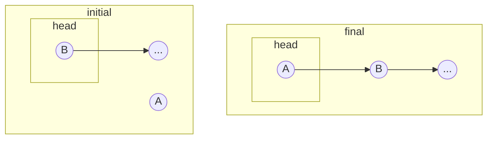
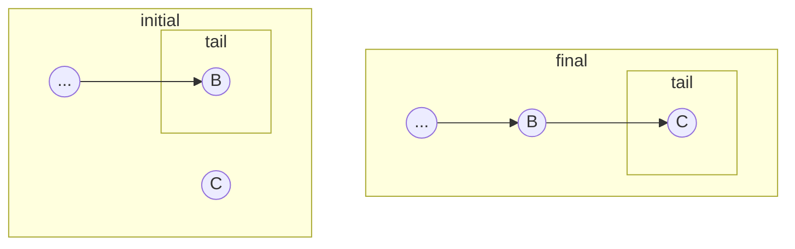
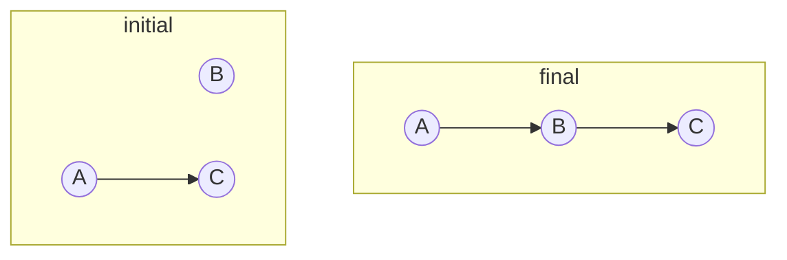
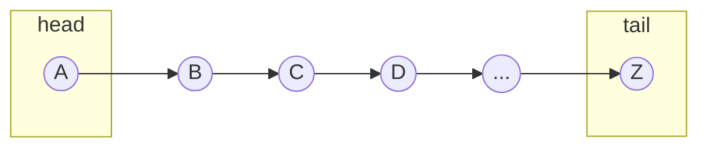
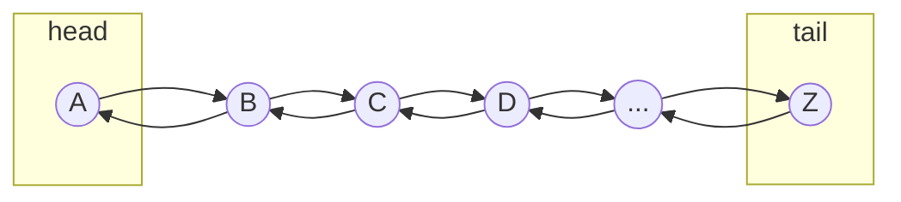
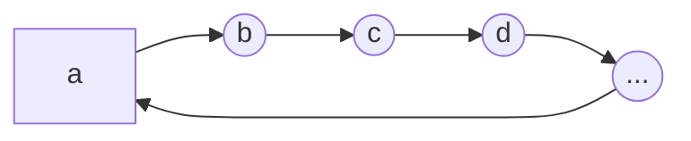
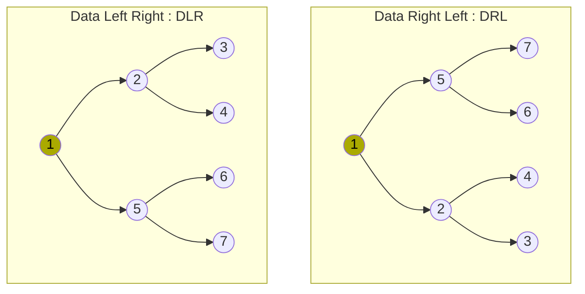
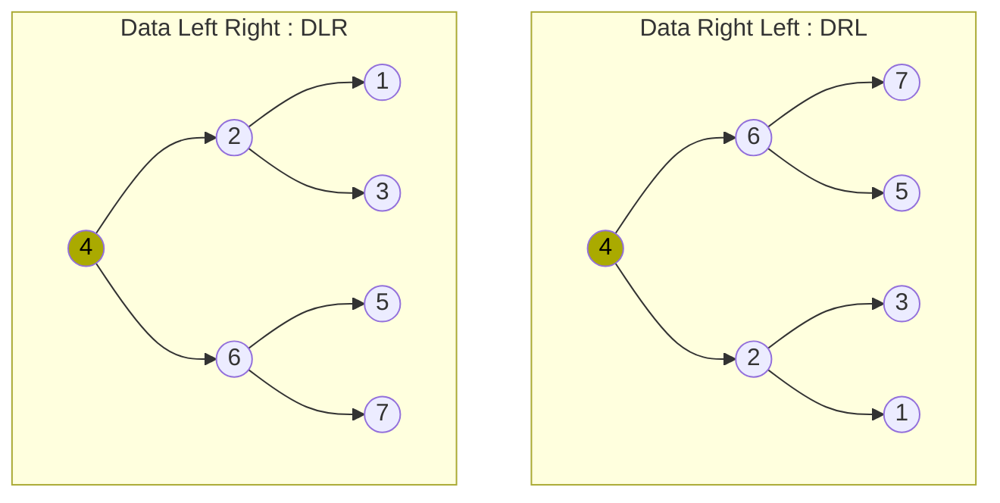
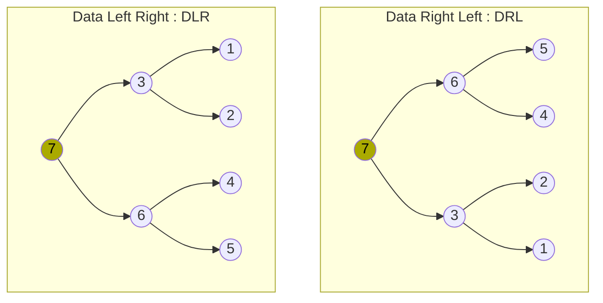

# 🚧 Data Structures <!-- omit from toc -->

My (hopefully brief) explanation of various data structures. The line between data structures and [algorithms](./algorithms.md) can be thin, at times and it is necessary to have some algorithm discussion in this document.

Data structures are inherently language specific. Implementation of a linked list in JavaScript is rather different from to the implementation in C which in turn is different from using built-in language features, such as C++'s `std::list`. I am attempting to be language agnostic in this document, but will also be viewing the topic through the lens of JavaScript.

- [🚧 Choosing a Data Structure](#-choosing-a-data-structure)
  - [🚧 Array vs. List vs. ArrayList](#-array-vs-list-vs-arraylist)
- [🚧 Array](#-array)
- [🚧 ArrayList](#-arraylist)
- [🚧 ArrayBuffer](#-arraybuffer)
- [🚧 Graphs and Related Concepts](#-graphs-and-related-concepts)
  - [Adjacency Matrix](#adjacency-matrix)
  - [🚧 Adjacency List](#-adjacency-list)
- [Linked List](#linked-list)
  - [Linked List Performance](#linked-list-performance)
  - [Node Insertion: At the start of the list](#node-insertion-at-the-start-of-the-list)
  - [Node Insertion: At the end of the list](#node-insertion-at-the-end-of-the-list)
  - [Node Insertion: Between two nodes](#node-insertion-between-two-nodes)
    - [Node Removal](#node-removal)
  - [Singly Linked Lists](#singly-linked-lists)
  - [Doubly Linked Lists](#doubly-linked-lists)
  - [Circular Linked Lists](#circular-linked-lists)
  - [Queue](#queue)
  - [Stack](#stack)
- [Trees](#trees)
  - [Types of Trees](#types-of-trees)
    - [Binary Tree](#binary-tree)
    - [B-tree](#b-tree)
    - [Binary Search Tree (BST)](#binary-search-tree-bst)
      - [🚧 BST: 2-3](#-bst-2-3)
      - [🚧 BST: AVL](#-bst-avl)
      - [🚧 BST: B-tree](#-bst-b-tree)
      - [🚧 BST: Red-Black Tree](#-bst-red-black-tree)
      - [🚧 BST: T-Tree](#-bst-t-tree)
      - [🚧 BST: treap](#-bst-treap)
    - [General Tree](#general-tree)
  - [Tree Properties](#tree-properties)
  - [Terminology](#terminology)
  - [Balanced Trees](#balanced-trees)
  - [Depth First Search (DFS)](#depth-first-search-dfs)
    - [Pre-Order](#pre-order)
    - [In-Order](#in-order)
    - [Post-Order](#post-order)
  - [Breadth-First Search (BFS)](#breadth-first-search-bfs)
- [Random Quotes](#random-quotes)
- [Additional Resources](#additional-resources)

# 🚧 Choosing a Data Structure

## 🚧 Array vs. List vs. ArrayList

- If you want to access only the "ends" of your data, choose a (linked) list.
- If you are randomly accessing data throughout the data set, choose an array

# 🚧 Array

# 🚧 ArrayList

# 🚧 ArrayBuffer

# 🚧 Graphs and Related Concepts

Graphs have been analyzed extensively in mathematics. ([Discrete Mathematics](https://en.wikipedia.org/wiki/Discrete_mathematics))

A graph is similar to a tree in that it has nodes and branches, but differs in that each node can have any number of edges from [0 ... n], where n is the number of nodes in the graph.

Edges are typically stored in an **Adjacency Matrix** or **Adjacency List**.

## Adjacency Matrix

If the number of nodes is known / fixed, an Adjacency Matrix is likely the correct choice. It is easy to implement (2D Bool Array), and is O(1) edge insertion/removal/lookup time. However, Adding/Removing a node is expensive: O(n$^2$).

```js
// Implement the Binary Tree edge structure, (see "Figure Tree") using an adjacency matrix
// A=0, B=1, ... K=11

// prettier-ignore
let edges = [
// A      B      C      D      E      F      G      H      I      J      K
  [false, true,  false, false, false, false, false, false, false, false, false], // A
  [true,  false, true,  true,  false, false, false, false, false, false, false], // B
  [false, true,  false, false, false, false, false, false, false, false, false], // C
  [false, true,  false, false, true,  true,  false, false, false, false, false], // D
  [false, false, false, true,  false, false, false, false, false, false, false], // E
  [false, false, false, true,  false, false, false, false, false, true,  false], // F
  [false, false, false, false, false, false, false, false, true,  true,  false], // G
  [false, false, false, false, false, false, false, false, true,  false, false], // H
  [false, false, false, false, false, false, true,  true,  false, false, false], // I
  [false, false, false, false, false, true,  true,  false, false, false, true ], // J
  [false, false, false, false, false, false, false, false, false, true,  false], // K
];
```

## 🚧 Adjacency List

Adding a node is cheap: O(n). Adding a an edge is cheap: O(n)

```js
// Implement the Binary Tree edge structure, (see "Figure Tree") using an adjacency list
let edges = {
  F: ["D", "J"],
  D: ["B", "E"],
  B: ["A", "C"],
  E: [],
  A: [],
  C: [],
  J: ["G", "K"],
  G: ["I"],
  K: [],
  I: ["H"],
  H: [],
};
```

# Linked List

A series of linked data containers (nodes) that contain reference(s) to the next node in the chain. (and the previous node, in a doubly linked list.) Implementation and effectiveness will vary depending on the programming language and use case.

(Implementing / Manipulating) a linked list is largely a matter of tedious and precise link management, in which the order of operations is important.

| Resource                                                                                           | Description                                      |
| -------------------------------------------------------------------------------------------------- | ------------------------------------------------ |
| [Linked List Implementation](https://github.com/waynefuchs/Algorithms/blob/main/src/LinkedList.ts) | My TypeScript generic implementation             |
| [Java LinkedList Class](https://docs.oracle.com/javase/8/docs/api/java/util/LinkedList.html)       | An example Linked List interface                 |
| [Wikipedia: Linked List](https://en.wikipedia.org/wiki/Linked_list)                                | Wikipedia's _Linked List (data structure)_ page. |

## Linked List Performance

Performance of linked lists are generally far slower than standard arrays, even for very large arrays. The reason for this is, mostly, CPU caching. Modern processors are very good at caching memory, and accessing random blocks of memory (linked lists) is many times slower than contiguous blocks. (arrays)

There are use cases for linked lists. (eg: stacks, queues) Linked lists are generally a construct to understand and implement trees and graphs. (My personal hot take)

> ⓘ It is generally computationally better to avoid using linked lists.
>
> ⓘ Linked lists provide cheap insertion and deletion of nodes.
>
> ⚠️ Traversal of the list to search for and obtain nodes is computationally expensive; `O(n)` in time complexity.
>
> ⓘ See Bjarne Stroustrup's talk on [why you should avoid linked lists](https://www.youtube.com/watch?v=cvZArAipOjo); commentary by [ThePrimeagen](https://www.twitch.tv/ThePrimeagen).

## Node Insertion: At the start of the list



```pseudocode
SET A.next = B
SET head = A
```

## Node Insertion: At the end of the list



```pseudocode
SET tail.next = C
SET tail = C
```

## Node Insertion: Between two nodes



Insertion of a new node `B` after node `A`, linking to node `C`

```pseudocode
SET B.next = C
SET A.next = B
```

### Node Removal

Removal of node `c` from the list pictured above is as follows:

```pseudocode
SET b's link to d
```

## Singly Linked Lists

A unidirectional chain of nodes from `head` to `tail`.



## Doubly Linked Lists

A bidirectional chain of nodes from `head` to `tail`. Implementation is very similar to a singly linked list, aside from increased complexity in link management. Memory size of the list is slightly increased due to and additional memory pointer being stored for each node.



## Circular Linked Lists



## Queue

Queues are FIFO (First-In First-Out), meaning they work exactly like a line at the checkout.

The preferred underlying data structure for a queue is the linked list, as it will provide O(1) operations for enqueue and dequeue.

|  method | implementation              | description                                       |
| ------: | --------------------------- | ------------------------------------------------- |
| dequeue | `item = linkedList.shift()` | Take item from the front of the queue             |
| enqueue | `linkedList.push(item)`     | Put item at the end of the queue                  |
|    peek | `linkedList.head`           | Look at the next item in line without removing it |

## Stack

- LIFO (Last-In First-Out)
- Synopsis: Works like the children's ring toy
- Push: `array.push(item)`: Add an item on to the top of the stack
- Pop: `item = array.pop()`: Take an item off of the top of the stack

# Trees

[Wikipedia: Tree (data structure)](<https://en.wikipedia.org/wiki/Tree_(data_structure)>)

A structure in which a single parent node exists with connected child nodes with no cyclical links. Trees are a subset of the graph (data structure).

> ⓘ Not all trees are Binary Trees.

## Types of Trees

### Binary Tree

A tree where each node has a _left_ and _right_ edge. (in other words, in `range(0, 2)` children)

### B-tree

A tree optimized for large data sets to minimize disk reads.

### Binary Search Tree (BST)

A binary tree where the data is ordered such that: `leftChild` <= `node` <= `rightChild` for every node in the tree.

There are many "flavors" of BST.

#### 🚧 BST: 2-3

[Wikipedia: 2-3 tree](https://en.wikipedia.org/wiki/2%E2%80%933_tree)

#### 🚧 BST: AVL

[Wikipedia: AVL tree](https://en.wikipedia.org/wiki/AVL_tree)

A Binary Search Tree (BST) with the additional constraint that the tree must be balanced. Named after Adelson-Velsky and Landis, the two inventors.

#### 🚧 BST: B-tree

[Wikipedia: B-tree](https://en.wikipedia.org/wiki/B-tree)

#### 🚧 BST: Red-Black Tree

#### 🚧 BST: T-Tree

#### 🚧 BST: treap

### General Tree

A tree with 0 or more children

## Tree Properties

- Where $n =$ `tree.length`, Trees have $n - 1 edges; one edge for each node's parent, where the root node does not have a parent edge.
- There is exactly one possible path from the root to any given node.

## Terminology

| Term             | Description                                                              |
| ---------------- | ------------------------------------------------------------------------ |
| branching factor | the number of children at each node                                      |
| child            | A node that has a parent                                                 |
| depth            | The distance from a node to the tree's root                              |
| edge             | The link between two nodes                                               |
| height           | The length of a node to its most distant leaf                            |
| leaf             | A node without any children                                              |
| node             | Elements that make up a tree, containing data and edge information       |
| root             | The top level node in the tree                                           |
| traversal        | The process of visiting each node in the tree exactly once in some order |
| visit            | Reading or Processing data in a node                                     |
| weak ordering    | A tree in which every child of each node is greater than its' parent     |

```
      ___F___           Depth 0, Height 4   [F]
     /       \
    D         J         Depth 1, Height 3   [D, J]
   / \       / \
  B   E     G   K       Depth 2, Height 2   [B, E, G, K]
 / \         \
A   C         I         Depth 3, Height 1   [A, C, I]
             /
            H           Depth 4, Height 0   [H]
```

> Figure: Tree

## Balanced Trees

A tree is only balanced if:

1. The children subtrees of every node differ by at most one
2. The left subtree is balanced (recursively)
3. The right subtree is balanced (recursively)

Otherwise, the tree is said to be unbalanced.

> ⓘ A sorted, balanced tree is known as an [AVL Tree](https://en.wikipedia.org/wiki/AVL_tree).

## Depth First Search (DFS)

Recursively follow branches all the way into each child node before backing out, one complete branch at a time.

> ⓘ Behaves like a stack (Push and Pop values to recurse the tree.)

> ⓘ Conventionally, left branches are visited prior to right branch traversal but is not required.

| Time Complexity | Space Complexity              |
| --------------- | ----------------------------- |
| O($n$)          | Between O(log $n$) and O($n$) |

- Inorder
  - Note: Data is visited in 'sorted order'
  - left-data-right (LDR) <- ascending
  - right-data-left (RDL) <- descending
- PostOrder
  - left-right-data (LRD)
  - right-left-data (RLD)

| Reference                                                            | Description                                                           |
| -------------------------------------------------------------------- | --------------------------------------------------------------------- |
| [Binary tree traversal](https://www.youtube.com/watch?v=gm8DUJJhmY4) | Covers Preorder, Inorder, Postorder; was assigned by The Odin Project |

### Pre-Order

A _pre-order walk_ is named because each node is **visited** prior to **walking** (recursing) through the tree.

> ⓘ There are two ways to pre-order walk; choose to go left first, or right first.



```pseudocode
// DLR              // DRL
VISIT               VISIT
walk(LEFT)          walk(RIGHT)
walk(RIGHT)         walk(LEFT)
```

### In-Order

Like the pre-order traversal, an _in-order walk_ gets its name from the position of the processing of the node in the recursive function; between processing the left and right children. This drastically changes the order that the nodes are processed.

> ⓘ In-Order Traversal only makes sense on Binary Trees.
>
> It does not make sense to do an In-Order Traversal of a General tree, as there is little (no?) benefit in walking $\frac{n}{2}$ child nodes, processing the current node, then finish walking the remaining half of the child nodes.

> ⓘ An In-Order walk of a _Binary Search Tree_ will result in an ordered array.



```pseudocode
// DLR              // DRL
walk(LEFT)          walk(RIGHT)
VISIT               VISIT
walk(RIGHT)         walk(LEFT)
```

### Post-Order



```pseudocode
// DLR              // DRL
walk(LEFT)          walk(RIGHT)
walk(RIGHT)         walk(LEFT)
VISIT               VISIT
```

## Breadth-First Search (BFS)

> ⓘ Behaves like a queue (Push and Pop values to recurse the tree.)

- Time Complexity: `O(n)`
- Space Complexity: `O(1)` -> `O(n)`
- ` L0:F -> L1:D,J -> L2:B,E,G,K -> L3:A,C,I -> L4:H`
- Sometimes called Level-Order Traversal
- Synopsis: Visit all nodes at each level before moving on to the next level by queuing a visit to all child nodes (left and right) for all nodes in the queue. [Binary tree: Level Order Traversal](https://www.youtube.com/watch?v=86g8jAQug04)

# Random Quotes

"Use vector as your default container." Bjarne Stroustroup

# Additional Resources

- CodesDope: [Introduction to Data Structures](https://www.codesdope.com/course/data-structures-introduction/)
