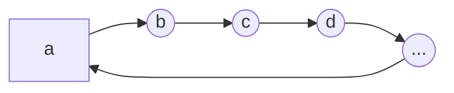
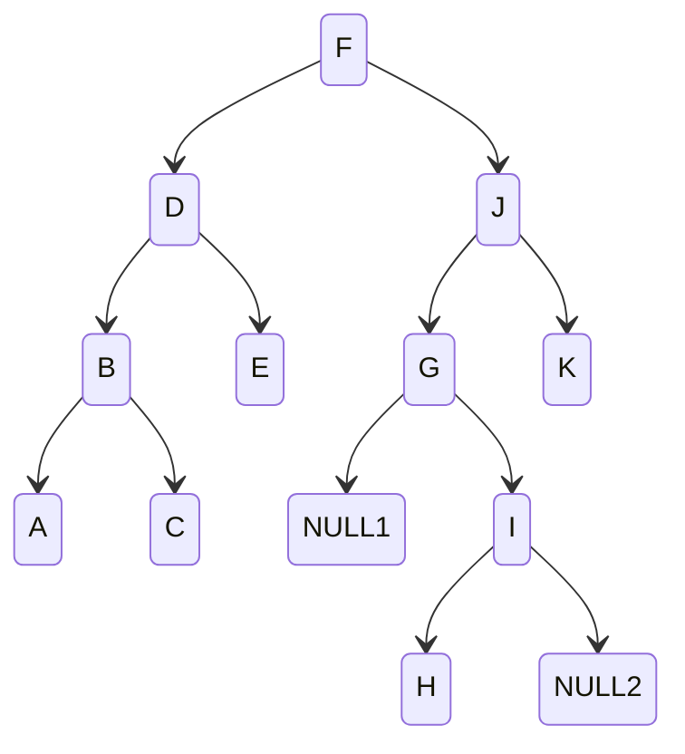

# Data Structures <!-- omit from toc -->

My (hopefully brief) explanation of various data structures. The line between data structures and [algorithms](./algorithms.md) is thin. There will be some cross over.

- [Choosing a Data Structure](#choosing-a-data-structure)
  - [Array vs. List vs. ArrayList](#array-vs-list-vs-arraylist)
- [Graphs and Related Concepts](#graphs-and-related-concepts)
  - [Adjacency Matrix](#adjacency-matrix)
  - [Adjacency List](#adjacency-list)
- [Array 👷](#array-)
- [ArrayList 👷](#arraylist-)
- [ArrayBuffer 👷](#arraybuffer-)
- [Linked List](#linked-list)
  - [Singly Linked Lists](#singly-linked-lists)
  - [Doubly Linked Lists](#doubly-linked-lists)
  - [Circular Linked Lists](#circular-linked-lists)
  - [Queue](#queue)
  - [Stack](#stack)
- [Trees](#trees)
  - [Tree Properties](#tree-properties)
  - [Types of Trees](#types-of-trees)
  - [Tree Outline](#tree-outline)
- [Additional Resources](#additional-resources)

# Choosing a Data Structure

## Array vs. List vs. ArrayList

- If you want to access only the "ends" of your data, choose a (linked) list.
- If you are randomly accessing data throughout the data set, choose an array
-

# Graphs and Related Concepts

Graphs have been analyzed extensively in mathematics. ([Discrete Mathematics](https://en.wikipedia.org/wiki/Discrete_mathematics))

A graph is similar to a tree in that it has nodes and branches, but differs in that each node can have any number of edges from [0 ... n], where n is the number of nodes in the graph.

Edges are typically stored in an **Adjacency Matrix** or **Adjacency List**.

## Adjacency Matrix

If the number of nodes is known / fixed, an Adjacency Matrix is likely the correct choice. It is easy to implement (2D Bool Array), and is O(1) edge insertion/removal/lookup time. However, Adding/Removing a node is expensive: O(n$^2$).

```js
// Implement the Binary Tree edge structure, (see "Figure Tree") using an adjacency matrix
// A=0, B=1, ... K=11

// prettier-ignore
let edges = [
// A      B      C      D      E      F      G      H      I      J      K
  [false, true,  false, false, false, false, false, false, false, false, false], // A
  [true,  false, true,  true,  false, false, false, false, false, false, false], // B
  [false, true,  false, false, false, false, false, false, false, false, false], // C
  [false, true,  false, false, true,  true,  false, false, false, false, false], // D
  [false, false, false, true,  false, false, false, false, false, false, false], // E
  [false, false, false, true,  false, false, false, false, false, true,  false], // F
  [false, false, false, false, false, false, false, false, true,  true,  false], // G
  [false, false, false, false, false, false, false, false, true,  false, false], // H
  [false, false, false, false, false, false, true,  true,  false, false, false], // I
  [false, false, false, false, false, true,  true,  false, false, false, true ], // J
  [false, false, false, false, false, false, false, false, false, true,  false], // K
];
```

## Adjacency List

Adding a node is cheap: O(n). Adding a an edge is cheap: O(n)

```js
// Implement the Binary Tree edge structure, (see "Figure Tree") using an adjacency list
let edges = {
  F: ["D", "J"],
  D: ["B", "E"],
  B: ["A", "C"],
  E: [],
  A: [],
  C: [],
  J: ["G", "K"],
  G: ["I"],
  K: [],
  I: ["H"],
  H: [],
};
```

# Array 👷

# ArrayList 👷

# ArrayBuffer 👷

# Linked List

A series of data containers called nodes that contain reference(s) to the next node. (and the previous node in a doubly linked list.) Implementation and effectiveness will vary depending on the programming language.

- The `head` node, or the first node in the list, must be stored to access the data in a linked list
- A reference to the `tail` node is also required for fast end-of-list insertion and removal
- A `length` or `count` counter should be maintained by the Linked List
- Each node will point to the `prev` and/or `next` node

Linked lists provide cheap insertion and deletion of nodes. These operations only require setting the associated links, which results in `O(1)` time complexity.

Traversal of the list to search for and obtain nodes is computationally expensive; `O(n)` in time complexity.

> ⓘ It is far better to use a different data structure if the list will need to be accessed at any point within the list other than the ends.

## Singly Linked Lists

> Implementation of singly linked lists is trivial.
>
> ```mermaid
> graph LR
>     A[a = head] --> B((b))
>     B --> C((c))
>     C --> D((d))
>     D --> E((...))
>     E --> F[z = tail]
> ```
>
> ### Node Insertion
>
> Insertion of a new node `n` after node `c` would be as follows (order is important):
>
> ```pseudocode
> SET n's link to d
> SET c's link to n
> ```
>
> ### Node Removal
>
> Removal of node `c` from the list pictured above is as follows:
>
> ```pseudocode
> SET b's link to d
> ```

## Doubly Linked Lists

> Insertion and deletion operations on doubly linked lists is somewhat nontrivial until familiarity is developed.
>
> ```mermaid
> graph LR
>     A((a)) --> B((b))
>     B --> A
>     B --> C((c))
>     C --> B
>     C --> D((d))
>     D --> C
>     D --> E((...))
>     E --> D
> ```
>
> ### Node Insertion
>
> Inserting a node `n` after node `c` would be as follows:
>
> ```pseudocode
> Obtain reference to d
> SET d.back to n
> SET n.forward to d
> SET n.back to c
> SET c.forward to n
> ```
>
> ### Node Removal
>
> Removal of node `c` from the list pictured above is as follows:
>
> ```pseudocode
> Obtain reference to b
> Obtain reference to d
> SET d.back to b
> SET b.forward to d
> // For cleanliness if the node will be reused
> SET c.back to null
> SET c.forward to null
> RETURN c
> ```

## Circular Linked Lists



## Queue

Queues are FIFO (First-In First-Out), meaning they work exactly like a line at the checkout.

The preferred underlying data structure for a queue is the linked list, as it will provide O(1) operations for enqueue and dequeue.

|  method | implementation              | description                                       |
| ------: | --------------------------- | ------------------------------------------------- |
| dequeue | `item = linkedList.shift()` | Take item from the front of the queue             |
| enqueue | `linkedList.push(item)`     | Put item at the end of the queue                  |
|    peek | `linkedList.head`           | Look at the next item in line without removing it |

## Stack

- LIFO (Last-In First-Out)
- Synopsis: Works like the children's ring toy
- Push: `array.push(item)`: Add an item on to the top of the stack
- Pop: `item = array.pop()`: Take an item off of the top of the stack

# Trees



```
      ___F___           Level 0 (F)
     /       \
    D         J         Level 1 (DJ)
   / \       / \
  B   E     G   K       Level 2 (BEGK)
 / \         \
A   C         I         Level 3 (ACI)
             /
            H           Level 4 (H)
```

> Figure: Tree

## Tree Properties

- A tree is a specialized graph.
- Trees have (n$_{count}$ - 1) edges; one edge for each node's parent, where the root node does not have a parent edge. (Thus: n-1 edges)
- There is exactly one possible path from the root to any given node.
- The node at the top of a tree is the **root** node.
- A node without any children is a **leaf** node.

## Types of Trees

- Binary Tree: A tree where each node has a _left_ and _right_ edge.
- Binary Search Tree: A binary tree where the data is ordered such that: `left <= node <= right` for every node in the tree. If duplicates are allowed (not usual), they will either always be on the left or on the right.
- Not all trees are Binary Trees. For example, if storing a tree of phone numbers, it may be beneficial to have a tree where each node has 10 branches, one for each digit 0-9.

## Tree Outline

> TODO: This should be split into sections

- Visiting a Node: Reading or Processing data in a node
- Tree Traversal: The process of visiting each node in the tree exactly once in some order.
- Breadth-First Traversal
  - Time Complexity: `O(n)`
  - Space Complexity: `O(1)` -> `O(n)`
  - ` L0:F -> L1:D,J -> L2:B,E,G,K -> L3:A,C,I -> L4:H`
  - Sometimes called Level-Order Traversal
  - Synopsis: Visit all nodes at each level before moving on to the next level by queuing a visit to all child nodes (left and right) for all nodes in the queue. [Binary tree: Level Order Traversal](https://www.youtube.com/watch?v=86g8jAQug04)
- Depth-First Traversal
  - Time Complexity: `O(n)`
  - Space Complexity: `O(log2 n)` -> `O(n)`
  - Synopsis: Recursively dig all the way into each node before backing out, one complete branch at a time. [Binary tree traversal: Preorder, Inorder, Postorder](https://www.youtube.com/watch?v=gm8DUJJhmY4)
  - Conventionally, left is visited prior to right branch traversal
  - Preorder
    - data-left-right (DLR)
    - data-right-left (DRL)
  - Inorder
    - Note: Data is visited in 'sorted order'
    - left-data-right (LDR) <- ascending
    - right-data-left (RDL) <- descending
  - PostOrder
    - left-right-data (LRD)
    - right-left-data (RLD)

# Additional Resources

- CodesDope: [Introduction to Data Structures](https://www.codesdope.com/course/data-structures-introduction/)
