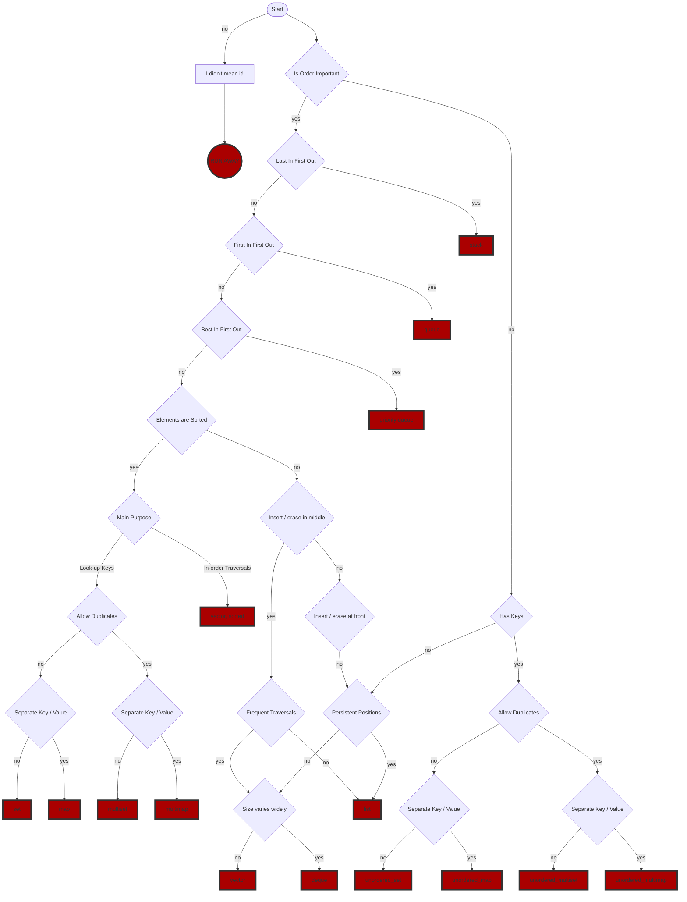

# I didn't mean to

```mermaid
flowchart
  start([Start]) --> order{Is Order Important}
  start -- no --> UHOH[I didn't mean it!] --> RUN((RUN AWAY)):::finish
  order -- no --> lookUpKeys{Has Keys}
  order -- yes --> lifo{Last In First Out}
  lifo -- no --> fifo{First In First Out}
  lifo -- yes --> stack[stack]:::finish
  fifo -- no --> bifo{Best In First Out}
  fifo -- yes --> queue[queue]:::finish
  bifo -- no --> keepSortedElements{Elements are Sorted}
  bifo -- yes --> pqueue[priority queue]:::finish
  keepSortedElements -- yes --> purpose{Main Purpose}
  purpose -- In-order Traversals --> vectorSorted[vector, sorted]:::finish
  purpose -- Look-up Keys --> allowDuplicatesA{Allow Duplicates}
  allowDuplicatesA -- no --> separateKeyValueA{Separate Key / Value}
  allowDuplicatesA -- yes --> separateKeyValueB{Separate Key / Value}
  separateKeyValueA -- no --> set:::finish
  separateKeyValueA -- yes --> map:::finish
  separateKeyValueB -- no --> multiset:::finish
  separateKeyValueB -- yes --> multimap:::finish
  keepSortedElements -- no --> insertEraseAtMiddle{Insert / erase in middle}
  insertEraseAtMiddle -- yes --> frequentTraversals{Frequent Traversals}
  frequentTraversals -- yes --> sizeVariesWidely
  frequentTraversals -- no --> list:::finish
  insertEraseAtMiddle -- no --> insertEraseAtFront{Insert / erase at front}
  insertEraseAtFront -- no --> persistentPositions{Persistent Positions}
  lookUpKeys -- no --> persistentPositions
  lookUpKeys -- yes --> allowDuplicatesB{Allow Duplicates}
  persistentPositions -- yes --> list
  persistentPositions -- no --> sizeVariesWidely{Size varies widely}
  sizeVariesWidely -- no --> vector:::finish
  sizeVariesWidely -- yes --> deque:::finish
  allowDuplicatesB -- no --> separateKeyValueC{Separate Key / Value}
  allowDuplicatesB -- yes --> separateKeyValueD{Separate Key / Value}
  separateKeyValueC -- no --> unorderedSet[unordered_set]:::finish
  separateKeyValueC -- yes --> unorderedMap[unordered_map]:::finish
  separateKeyValueD -- no --> unorderedMultiset[unordered_multiset]:::finish
  separateKeyValueD -- yes --> unorderedMultimap[unordered_multimap]:::finish

classDef finish fill:#a00,stroke:#333,stroke-width:4px
```
