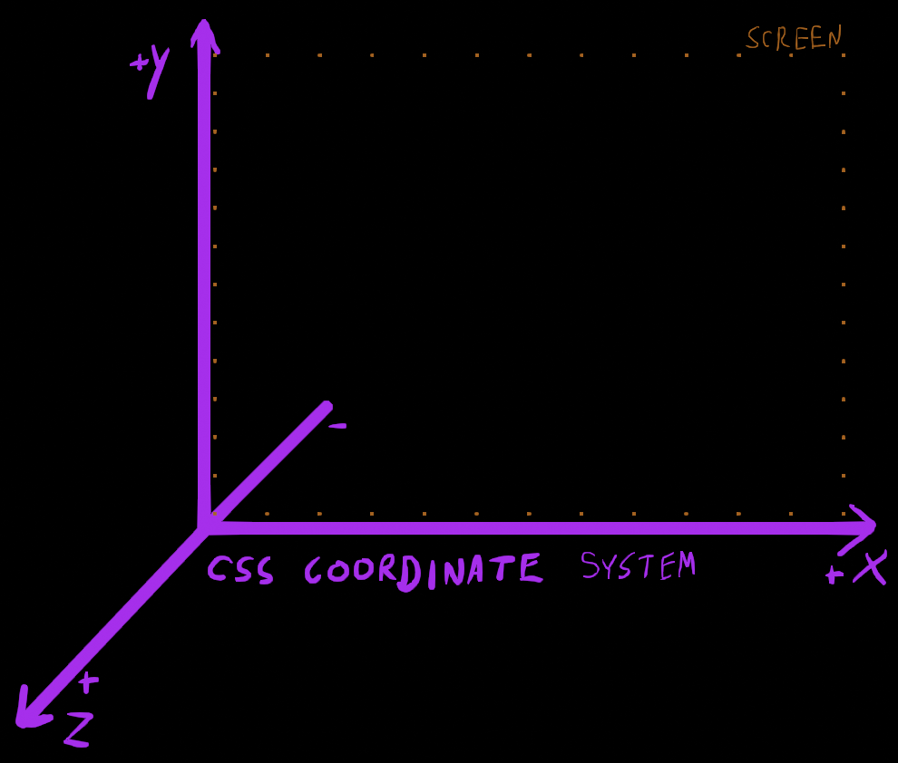

- [CSS Transforms](#css-transforms)
  - [Links](#links)
  - [Gotchas](#gotchas)
  - [Perspective](#perspective)
    - [Values](#values)
  - [Coordinate System](#coordinate-system)
  - [Rotate](#rotate)
  - [Scale](#scale)
  - [Skew](#skew)
  - [Translate](#translate)
  - [Chaining Transforms](#chaining-transforms)
  - [Matrix](#matrix)
    - [Calculating values:](#calculating-values)

# CSS Transforms

## Links

- [MDN transform-function](https://developer.mozilla.org/en-US/docs/Web/CSS/transform-function): Mozilla Docs
- [The World of CSS Transforms](https://www.joshwcomeau.com/css/transforms/): A look at transforms, and some really cool use cases.
- [Framer](https://www.framer.com/motion/): An animation library for React.

## Gotchas

- Inline elements don't work with transforms

## Perspective

| function              | description                               |
| --------------------- | ----------------------------------------- |
| {perspective: value;} | Distance between z=0 plane, and the user. |

**if you intend to use 3d transforms**: This is a required property, meant to be applied to a parent container to set up the "Camera Lens Matrix" to be applied on top of any other transforms to view perspective.

Close values (eg: 100px) will result in severe fish-eye. Values in the 600-1200px range seem to be fairly appropriate for standard 'phone camera' perspective.

### Values

| value    | description                                             |
| -------- | ------------------------------------------------------- |
| none     | disable                                                 |
| px       | offset in pixels (less than 1px is clamed to 1px)       |
| em / rem | offset in em or rem                                     |
| `other`  | I _think_ any length postfix is converted               |
| global   | `inherit`, `initial`, `revert`, `revert-layer`, `unset` |

## Coordinate System



## Rotate

> Allowed parameters for `a` (amount):
> deg, rad, turn

| function             | description                                                                                                          | 3D  |
| -------------------- | -------------------------------------------------------------------------------------------------------------------- | --- |
| rotateX(a)           | Rotate along `x` axis                                                                                                |     |
| rotateY(a)           | Rotate along `y` axis                                                                                                |     |
| rotateZ(a)           | Rotate along `z` axis                                                                                                |     |
| rotate(a)            | Rotate around the origin (see [transform-origin](https://developer.mozilla.org/en-US/docs/Web/CSS/transform-origin)) |
| rotate3d(x, y, z, a) | Rotate a normalized [x, y, z] vector by `a`                                                                          | ☑️  |

> Note: In rotate3d, if the vector [x, y, z] does not have a unit length, the vector will be normalized.

## Scale

> Allowed parameters:
>
> `multiple`: float that will scale by the value supplied
>
> `%`: Percent is also allowed

| function            | description                                | 3D  |
| ------------------- | ------------------------------------------ | --- |
| scaleX(v)           | Resize in the `x` direction                |     |
| scalelY(v)          | Resize in the `y` direction                |     |
| scale(vX, vY)       | Resize in the `x` and `y` direction        |     |
| scaleZ(v)           | Resize along the `z` axis                  | ☑️  |
| scale3d(vX, vY, vZ) | Resize in the `x`, `y`, and `z` direction. | ☑️  |

## Skew

> Allowed parameters:
> `deg`, `rad`

| function         | description                                                        |
| ---------------- | ------------------------------------------------------------------ |
| skewX(`v`)       | Skew along `x` (top goes left, bottom goes right for positive `v`) |
| skewY(`v`)       | Skew along `y` (left goes up, right goes down for postive `v`)     |
| skew(`xv`, `yv`) | Skew `x` and `y` with a single call                                |

skewX, skewY, skew (deg, rad)

## Translate

> Available parameters:
>
> position (absolute/relative)
>
> percent (%): This is percentage of the element(!) eg: 100% will translate the width or height of the element.

> Note: The z-axis extends positively towards the camera.

| function                   | description                                                               | 3d  |
| -------------------------- | ------------------------------------------------------------------------- | --- |
| translateX(`x`)            | Translate an element along the `x` axis.                                  |     |
| translateY(`y`)            | Translate an element along the `y` axis.                                  |     |
| translate(`x`, `y`)        | Translate an element along `x` and `y` axis in one call                   |     |
| translateZ(`z`)            | Translate in the `z` direction. (+) towards camera, (-) away from camera. | ☑️  |
| translate3d(`x`, `y`, `z`) | Translate in the `x`, `y`, and `z` directions with a single property      | ☑️  |

## Chaining Transforms

TODO:::: The

## Matrix

The values are something along the lines of:

```css
.tag {
  /* transform: matrix(scaleX, skewY, skewX, scaleY, translateX, translateY); */
  transform: matrix(1.25, 0, 0, 0.75, 0, 0);
}
```

> Note: the values are floating point numbers, and not units.

### Calculating values:

For complex transforms, you need to build the final result by chaining transforms. Then, there are two options to retrieve these values for use in a `matrix()` parameter.

**Option 1**: The JavaScript `Window.getComputedStyle()` method will retrieve the computed value of the transform function.

**Option 2**: Get the computed value from the browser's developer tools. (Chrome: Select the element, then under Elements > Computed the matrix values are listed.)
