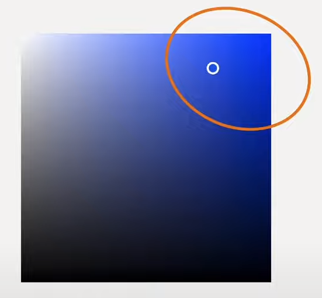
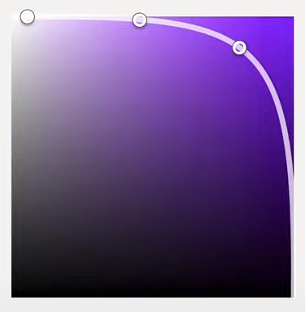
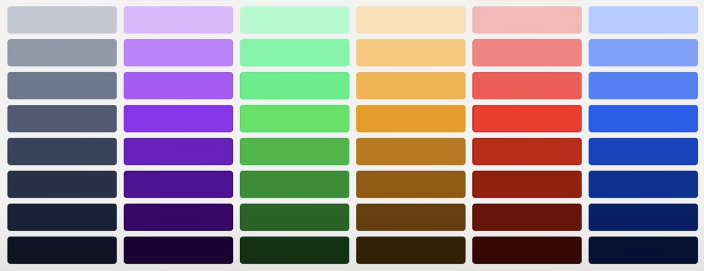

- [Design](#design)
- [Links](#links)
- [Color Palette](#color-palette)
- [Colors](#colors)
  - [Brand Colors (1, maybe 2 colors)](#brand-colors-1-maybe-2-colors)
  - [Supporting Colors (4 colors)](#supporting-colors-4-colors)
  - [Neutral (1 color)](#neutral-1-color)
- [Color Shades](#color-shades)
- [Finalizing](#finalizing)
- [HSB Color Picker](#hsb-color-picker)

# Design

# Links

| Title                                                            | Author   | Description                                             |
| ---------------------------------------------------------------- | -------- | ------------------------------------------------------- |
| [Huemint](https://huemint.com/)                                  | Huemint  | Generate color palette for a brand, website, or graphic |
| [UI Color Palettes](https://www.youtube.com/watch?v=yYwEnLYT55c) | UX Tools | A great video on color                                  |

# Color Palette

1. Brand Colors
   - One or Two colors
   - Used throughout the site, as "splashes of color" to determine the feel of the site. A good example of this is "facebook blue" which makes the app "feel blue" even though most of the app is "grace"
   - Usage: `Buttons`, `Links`, `Icons`, `Navigation`
2. Supporting Colors
   - Used to draw attention or communicate using color
   - Usage: `Error Messages`, `Confirmation`, `Informational Dialogs`
3. Neutrals
   - Usage: `Text`, `Backgrounds`, `Border Colors`, `Secondary Buttons`

# Colors

Attempt at a description for what colors are required in a UI.

## Brand Colors (1, maybe 2 colors)

The brand colors usually come from the business; and will likely have been chosen at the time the company developed their branding package. If there is no branding available, as you will find for small businesses, here are some tips to build a 'Brand Color' for UI/UX.

Choose a good "middle color(s)" for your 'Brand Color(s)'

This is a color that your lighter and darker colors will be based on.

- This color will usually come from the upper right of a standard RGB color picker.

  

- This color works well as a button background color

  

## Supporting Colors (4 colors)

Supporting colors are used in dialog messages and icons to easily convey information to the user in a universal manner.

Color should not be the _only_ way that this information is conveyed, but things like red text in a form is pretty universal for "Something you entered is wrong in the terms of what this form was expecting."

1. Success Color: Usually a (Green) is needed
2. Warning Color: Usually a (Yellow or Orange)
3. Error Color: Usually a (Red)
4. Info Color: Usually a (Blue) for neutral informational messages

Supporting colors need to feel like they go along with your brand colors. Pay attention to saturation and brightness levels (HSV) in comparison to the brand colors. Both values (S & B) should be within 5 or 10 of the brand color. Once you have the S and B set, you can adjust the hue to be whatever you like.

## Neutral (1 color)

Pick a middle gray and follow the same methodology as used in [Color Shades](#color-shades). The HSB neutral curve will go in the opposite direction as the color shade curve to remain in the grays.


# Color Shades

It can be helpful to create many shades of each color for use throughout a design. Using 5 or 9 shades is recommended.

Colors on the HSB scale should be chosen using a 0-1000 scale to specify tint, similar to font weight. The image, shown below, indicates the 100, 300, and 500 starting points.

> ⓘ After all hues are chosen, further work should be done to ensure correct monochromatic tint across the site; this method is to find a starting place for your color shades.



| Step |      Value      |  H  |   S    | B      | Description                                                         |
| :--: | :-------------: | :-: | :----: | ------ | ------------------------------------------------------------------- |
|  1   |       500       |  H  |   S    | B      | The chosen color; middle point                                      |
|  2   |       900       |  H  | 90-100 | 20-30  | Darkest; usually used for text                                      |
|  3   |       100       |  H  |  0-10  | 90-100 | Lightest; usually used for background                               |
|  4   |       300       |  H  | curve  | curve  | The light midpoint                                                  |
|  5   |       700       |  H  | curve  | curve  | The dark midpoint                                                   |
| 6-9  | 200,400,600,800 |  H  | curve  | curve  | Find the remaining midpoints for each shade, and fill in the values |

# Finalizing

I prefer to minimize the number of colors I use in my site. I would likely only import the colors that were used.

```css
:root {
  /* An example */
  --c-brand-a-100: almost-white;
  --c-brand-a-200: darker;
  --c-brand-a-300: darker
  --c-brand-a-400: darker;
  --c-brand-a:     #abc123;
  --c-brand-a-500: var(--c-brand-a);
  --c-brand-a-600: darker;
  --c-brand-a-700: darker;
  --c-brand-a-800: darker;
  --c-brand-a-900: almost-black;

  --c-brand-b: #123abc;
  --c-neutral: gray;
  --c-success: green;
  --c-warn: orange;
  --c-error: red;
  --c-info: blue;
}
```



# HSB Color Picker

Use the HSB color picker when choosing colors for UI/UX, as it gives "finer control" over colors in a more understandable way.

> `H` Hue (1-365):
>
> A number that defines color values, all the way around the color wheel

> `S` Saturation (0-100):
>
> How intense the color is on a percentage scale

> `B` Brightness (1-100)
>
> How much black or white is being added to the color on a percentage scale. Anything over 50 will have white added, anything under 50 will have black added.
