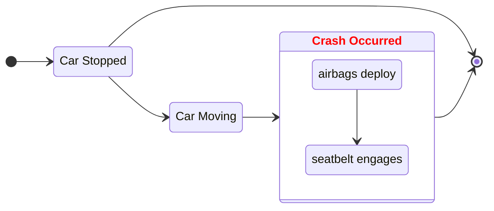

[figure-headings]: ./.project/figures/markdown/headings.png

# Markdown <!-- omit in toc -->

# 🚧 Work In Progress <!-- omit in toc -->

- asdf
- 07JUL2023

---

Markdown is a Text-to-HTML _~~hack of a perl script~~_ translation tool. It allows for easily written and readable text documents that can be parsed into well organized and easily searchable formatted and styled documentation.

The constraints provided by Markdown _also_ force "good" note-taking habits. Most people will notice the quality of their notes will improve when using markdown.

- [Markdown ➡ PDF](#markdown--pdf)
- [Git README.md](#git-readmemd)
- [Headings](#headings)
- [🚧 Links](#-links)
  - [Internal / External Links](#internal--external-links)
  - [➕ Link Definitions](#-link-definitions)
- [🚧 Mermaid](#-mermaid)
  - [State Diagram](#state-diagram)
    - [An example State Diagram (Graph)](#an-example-state-diagram-graph)
- [Reference Links](#reference-links)

# Markdown ➡ PDF

```bash
pandoc ./footprints.md -o test.pdf
pandoc ./footprints.md -V geometry:landscape -o test.pdf
```

# Git README.md

The `README.md` is the public face for every project and being able to write a good one is important. Some recommendations:

1. Use Media
   - Photos (screenshots, pictures, emoji, logos, etc)
   - Videos
   - Audio
2. Provide installation instructions
3. Provide instructions for operation of the software
   - Prerequisites
   - Configuration
   - Options
   - Standard _and_ Non-standard use cases
   - CLI Switches
4. List technologies used
5. (If applicable) Provide information on how to contribute towards the project
6. (if applicable) License information
7. (if applicable) Credit any resources being used (images, boiler plate / starter code, libraries, etc.)
8. (optional/blog) Your development process
9. (optional/blog) Motivation and Passion behind the project

> ⓘ Note: The [Fira Code](https://github.com/tonsky/FiraCode) github project is one of the better Markdown files that I have seen. (It's the one that immediately came to mind when thinking of examples.)

# Headings

Headings are not to be used for formatting. They are used for document structure. Technically

```markdown
# Heading Level 1

## Heading Level 2

### Heading Level 3

#### Heading Level 4

##### Heading Level 5

###### Heading Level 6
```

![Heading Example][figure-headings]

# 🚧 Links

> 🚧 TODO: Links are so simple, and incredibly complicated because of the difference between markdown variants.

## Internal / External Links

```Markdown
[Internal Page Link](README.md)
[External Page Link](https://www.google.com/)
```

[Internal Page Link](README.md): This Project's Landing Page
[External Page Link](https://www.google.com/): Google

## ➕ Link Definitions

A link definition is a variable that is stripped from the document in the HTML output.

There are three parts to a link defiition. `[arbitrary case-insensitive reference text]: https://with.some.uri "And an Optional Title"`

Link Definition Example

```Markdown
[project-main-readme]: ./README.md "This Project"
[Foo Bar](project-main-readme)
```

<!-- This will not be rendered -->

[project-main-readme]: ./README.md "This Project" <!-- The Link Definition -->

[Foo Bar](project-main-readme) <!-- The Link Definition being used -->

<!-- END non-rendering Link Definition Example -->

This defines a "markdown variable" with the key-value pair of:

|                     key                     |             value             |
| :-----------------------------------------: | :---------------------------: |
| `arbitrary case-insensitive reference text` | `https://www.somewebsite.org` |

[arbitrary case-insensitive reference text]: https://www.somewebsite.org

> ⓘ The example code is also inserted into the markdown document between this quote and the table above; inserting the `https://www.somewebsite.org` link, invisibly into the document.

> ⓘ I use this technique to link all the figures used in my markdown. I locate them at the top of the document.
>
> 1. This allows me to see what figures are in the document at a glance (While editing the markdown)
> 2. I can easily update the links where necessary

| Link                                                                                        | Description             |
| ------------------------------------------------------------------------------------------- | ----------------------- |
| [I'm an inline-style link](https://www.somewebsite.com)                                     | Normal Link             |
| [I'm an inline-style link with title](https://www.somewebsite.com "somewebsite's Homepage") | Mouse over to see title |
| [I'm a reference-style link][Arbitrary case-insensitive reference text]                     | Variable                |
| [I'm a relative reference to a repository file](../blob/master/LICENSE)                     |                         |
| [You can use numbers for reference-style link definitions][1]                               |                         |
| Or leave it empty and use the [link text itself]                                            |                         |
| Some text to show that the reference links can follow later.                                |                         |

Link will direct user here.

[1]: http://somewebsite.org
[link text itself]: http://www.somewebsite.com

# 🚧 Mermaid

This is possibly the coolest addition to markdown.

> 🚧 TODO: Add examples in for each mermaid module

## State Diagram

A state diagram is a type of diagram used in computer science and related fields to describe the behavior of systems. They require that the system described is composed of a finite number of states.

### An example State Diagram (Graph)



# Reference Links

| Title                                                                                                                                                          | Site            | Description                                                                                                                                                                                                                            |
| -------------------------------------------------------------------------------------------------------------------------------------------------------------- | --------------- | -------------------------------------------------------------------------------------------------------------------------------------------------------------------------------------------------------------------------------------- |
| [Markdown](https://docs.github.com/en/get-started/writing-on-github/getting-started-with-writing-and-formatting-on-github/basic-writing-and-formatting-syntax) | Github          | Markdown guide, produced by the site that is rendering this markdown; github.                                                                                                                                                          |
| [Cheat Sheet](https://www.markdownguide.org/cheat-sheet/)                                                                                                      | Markdown Guide  | Has a lot of concise examples, and an "extended syntax" page that is very good for table formatting.                                                                                                                                   |
| [Extended Syntax](https://www.markdownguide.org/cheat-sheet/)                                                                                                  | Markdown Guide  | Great for making tables behave reasonably in Gitea and on GitHub                                                                                                                                                                       |
| [CommonMark](https://commonmark.org/)                                                                                                                          | Common Mark     | Advocate for a common specification for markdown                                                                                                                                                                                       |
| [Markdown in 60 sec](https://commonmark.org/help/)                                                                                                             | Common Mark     | Learn Markdown in 60 seconds (It really is this easy to get started.)                                                                                                                                                                  |
| [Markdown in 10 min](https://commonmark.org/help/tutorial/)                                                                                                    | Common Mark     | A tutorial that has you practice markdown, meant to take about ten minutes.                                                                                                                                                            |
| ...[Variables?](https://stackoverflow.com/questions/24580042/github-markdown-are-macros-and-variables-possible)                                                | StackOverflow   | I learned many things from the discussion on this page.                                                                                                                                                                                |
| [Markdown: Syntax](https://daringfireball.net/projects/markdown/syntax)                                                                                        | Daring Fireball | The original source of Markdown.                                                                                                                                                                                                       |
| [On why Markdown is not a good, or even a half-decent, markup language](https://news.ycombinator.com/item?id=36793694)                                         | Hacker News     | I disagree. The comments are a bit spicy and incredibly informative / interesting with a lot of very knowledgeable people providing links.<br />🚧 TODO: Finish gleaning what I can from the comments before the info is lost to time. |
